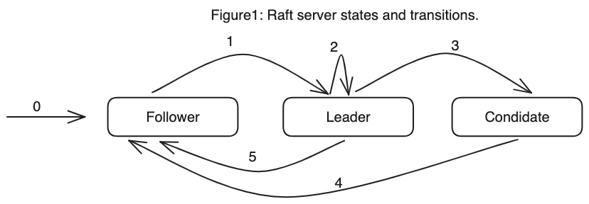

# Raft Consensus Explained
Raft is a consensus algorithm used in distributed systems to ensure agreement among all members on the state of the system despite potential failures. 
### Key processes:

- **Leader election:** If the leader fails or becomes unavailable, any server can initiate an election. Servers vote based on their current term and log information. The candidate with the most votes (majority) becomes the new leader.
- **Log replication:** The leader receives client requests and proposes them as entries to its log. It then replicates these entries to all followers. Followers acknowledge receiving the entries and apply them to their own logs if they agree and their logs are up-to-date.
- **Safety:** Raft ensures that only one leader exists at a time and that all followers have the same log entries in the same order. This guarantees that all nodes agree on the current state of the system.

```
A Raft cluster consists of many servers. A minimum of five is typical that can tolerate two failures. A server may be in three states, namely, (i) leader, (ii) follower, or (iii) candidate. The candidates are servers that offer to become a leader during an election term. If a leader or a candidate detects an old term, it transits to a follower state. The state transition diagram is given in Figure 1. The transitions are labeled from 0 to 5. A summary of the transitions is given as follows:
```
1. State 0: The state at which a server joins the system.
2. State 1: A transition from state 0 to 1 happens as follows. A server detects a
time-out if the current leader fails to respond in a prespecified heartbeat. The
follower may offer to become a candidate and initiates an election.
3. State 2: When a split vote occurs, no one gets a majority, and a server in the
candidate state can continue to initiate an election for a new term.
4. State 3: A server in the candidate state receiving a majority vote becomes the
leader and changes its state to the leader.
5. State 4: If the leader fails to respond at any time during its term, then it cannot
retain its leadership state and reverts to a follower when it returns.
6. State 5: If a candidate fails to get a majority, it returns to become a follower.


## common use cases for the Raft consensus algorithm include:

1. **Distributed Databases:**
    - Many distributed databases use Raft to ensure consistency among nodes in the system. Raft helps coordinate the distribution of data and the execution of transactions across multiple nodes, providing a reliable and fault-tolerant system.
2. **Key-Value Stores:**
    - Raft is often employed in distributed key-value stores, where maintaining consistency across nodes is essential for data reliability. Systems like etcd and Consul use Raft to manage the distributed storage of configuration data and key-value pairs.
3. **Distributed File Systems:**
    - File systems that operate in a distributed environment, such as Hadoop Distributed File System (HDFS) and Ceph, may use Raft to manage metadata and coordinate activities among multiple nodes.
4. **Cloud Infrastructure Services:**
    - Raft can be applied in cloud infrastructure services, like load balancers, where multiple nodes need to agree on the state and distribution of incoming requests to ensure high availability and fault tolerance.
5. **Container Orchestration Systems:**
    - Container orchestration systems, such as Kubernetes, need a reliable consensus algorithm to manage the deployment and scaling of containerized applications across a cluster of nodes. Raft can be employed for coordination and leader election in such systems.
6. **Consistent Configuration Management:**
    - Systems that require consistent configuration management, like distributed configuration stores, use Raft to maintain a consistent and up-to-date configuration across all nodes in the distributed environment.
7. **Messaging Systems:**
    - Raft can be used in messaging systems to ensure that all nodes agree on the order of messages and to coordinate the delivery of messages in a fault-tolerant manner.
8. **Highly Available Services:**
    - Applications requiring high availability often use Raft to coordinate and manage replicated state machines, ensuring that a majority of nodes agree on the current state and allowing the system to continue functioning even if some nodes fail.
</aside>