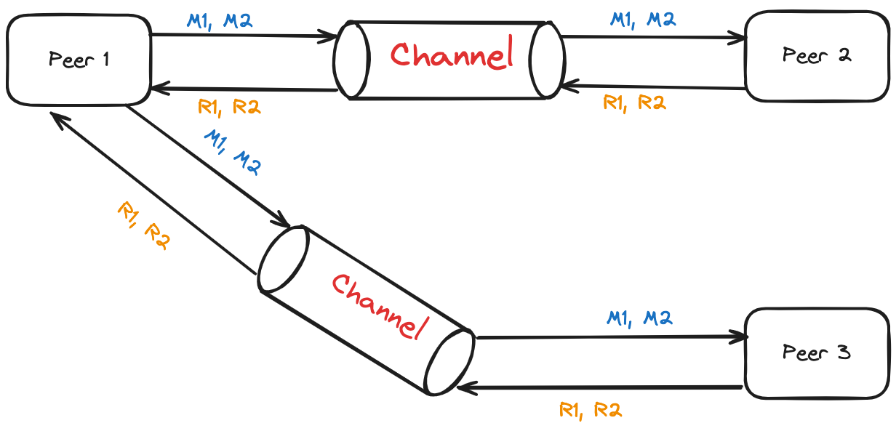

# Still Working on 

-------------------------------------------------------------
A single socket channel, while not a prevalent design pattern, can be used in specific scenarios within a distributed system. This approach involves establishing a single, persistent connection between a follower node and a leader node. All communication between these nodes flows through this dedicated channel.

## Problem
When we are using Leader and Followers, we need to ensure that messages between the leader and each follower are kept in order, with a retry mechanism for any lost messages. We need to do this while keeping the cost of new connections low, so that opening new connections doesn’t increase the system’s latency.

## Solution

**Single Socket Channel Use cases:**

- **Leader-follower replication:** In a leader-follower replication system, the follower can maintain a single connection to the leader for receiving updates and replicating data.
- **Dedicated control channel:** A separate socket channel can be established for control messages between specific nodes, while message passing handles data exchange.
